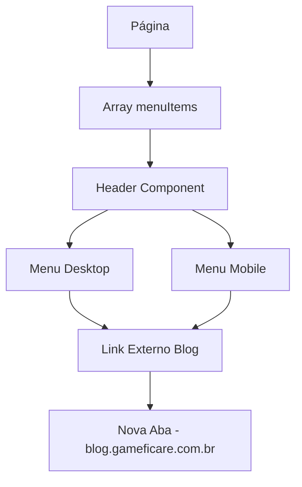

# Design Document

## Overview

Este documento descreve o design para adicionar um novo item de menu "Blog" no componente Header da aplicação React. O menu será posicionado entre "Projetos" e "Contato" e abrirá o blog da empresa (https://blog.gameficare.com.br) em uma nova aba quando clicado.

## Architecture

A implementação seguirá o padrão existente da aplicação:

1. **Componente Header**: Já existe e aceita uma prop `menuItems` como array de objetos
2. **Páginas**: Cada página (HomePage, SobrePage, ProjetosPage, ContatoPage) passa o array `menuItems` para o Header
3. **Roteamento**: Como é um link externo, não utilizará React Router, mas sim um elemento `<a>` HTML padrão

### Fluxo de Dados



## Components and Interfaces

### Header Component (Existente - Modificação)

O componente Header já está preparado para receber diferentes tipos de links através da prop `menuItems`. Precisaremos modificar a lógica para distinguir entre:

- **Links internos**: Usam React Router (`as={Link}`)
- **Links externos**: Usam elemento `<a>` HTML padrão

### MenuItem Interface

```typescript
interface MenuItem {
  label: string;
  link: string;
  external?: boolean; // Nova propriedade opcional
}
```

### Modificações no Header

1. **Detecção de Link Externo**: Verificar se o link começa com `http://` ou `https://`
2. **Renderização Condicional**: 
   - Links internos: `<MenuItem as={Link} to={item.link}>`
   - Links externos: `<MenuItem as="a" href={item.link} target="_blank" rel="noopener noreferrer">`

## Data Models

### MenuItems Array (Atualizado)

```javascript
const menuItems = [
  { label: 'Home', link: '/' },
  { label: 'Sobre', link: '/sobre' },
  { label: 'Projetos', link: '/projetos' },
  { label: 'Blog', link: 'https://blog.gameficare.com.br' }, // Novo item
  { label: 'Contato', link: '/contato' },
];
```

### Lógica de Detecção

```javascript
const isExternalLink = (url) => {
  return url.startsWith('http://') || url.startsWith('https://');
};
```

## Correctness Properties

*A property is a characteristic or behavior that should hold true across all valid executions of a system-essentially, a formal statement about what the system should do. Properties serve as the bridge between human-readable specifications and machine-verifiable correctness guarantees.*

### Property 1: Menu positioning and presence
*For any* page component that renders a Header, the Blog menu item should appear in the correct position (between "Projetos" and "Contato") in both desktop and mobile views
**Validates: Requirements 1.1, 1.4, 2.1**

### Property 2: External link behavior
*For any* Blog menu item, when rendered, it should have href="https://blog.gameficare.com.br", target="_blank", and rel="noopener noreferrer" attributes
**Validates: Requirements 1.2, 3.1, 3.2**

### Property 3: Structural and visual consistency
*For any* Blog menu item, it should follow the same data structure as other menu items and maintain consistent visual styling
**Validates: Requirements 1.3, 2.3**

### Property 4: Mobile menu interaction
*For any* mobile view, clicking the Blog menu item should close the mobile menu and open the external link
**Validates: Requirements 1.5**

### Property 5: Accessibility compliance
*For any* Blog menu item, it should include appropriate ARIA labels, external link indicators, and maintain keyboard navigation standards
**Validates: Requirements 2.4, 2.5, 3.3**

## Error Handling

### Invalid URL Handling
- Se a URL do blog estiver malformada, o sistema deve falhar graciosamente
- Links externos devem ser validados para garantir que começam com `http://` ou `https://`

### Mobile Menu State Management
- Se houver erro ao fechar o menu mobile, o estado deve ser resetado
- Overflow do body deve ser restaurado mesmo em caso de erro

### Accessibility Fallbacks
- Se ARIA labels não estiverem disponíveis, usar texto alternativo
- Garantir que o link seja navegável por teclado mesmo sem JavaScript

## Testing Strategy

### Unit Tests
- Testar renderização do componente Header com o novo menu item
- Verificar atributos corretos do link externo (href, target, rel)
- Testar comportamento do menu mobile com o novo item
- Validar estrutura de dados do menuItems array

### Property-Based Tests
- **Configuração**: Usar Jest e React Testing Library
- **Iterações**: Mínimo 100 iterações por teste de propriedade
- **Geração de dados**: Criar geradores para diferentes configurações de menuItems
- **Cobertura**: Testar todas as propriedades de correção definidas

### Integration Tests
- Testar integração entre todas as páginas e o Header
- Verificar que mudanças no menuItems se refletem em todas as páginas
- Testar navegação e comportamento em diferentes dispositivos

### Accessibility Tests
- Usar ferramentas como axe-core para validação automática
- Testar navegação por teclado
- Verificar compatibilidade com leitores de tela

Cada teste de propriedade deve ser marcado com: **Feature: header-blog-menu, Property {number}: {property_text}**
